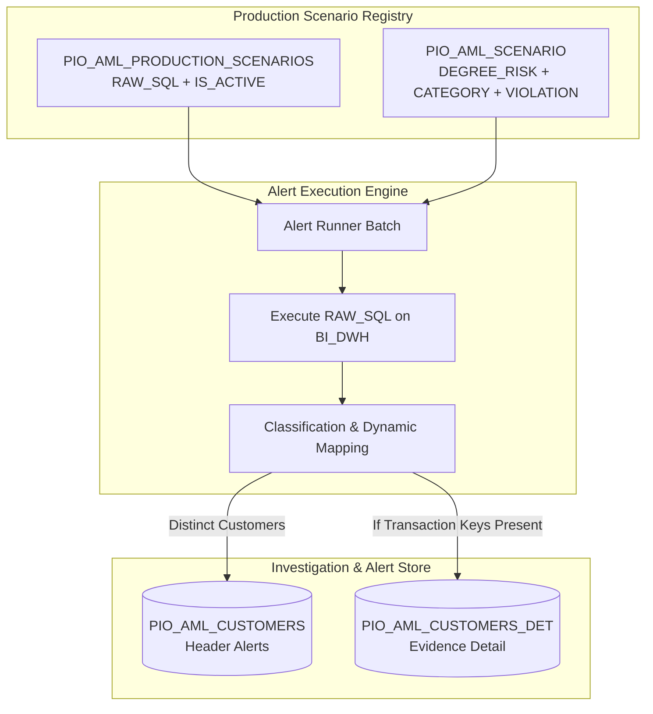

# Standalone Daily AML Alert Execution Engine (Alert Runner)

## 1. Overview & Business Purpose
The **Standalone Daily AML Alert Execution Engine** is the offline production batch runner for the AI AML Agent ecosystem. 

While the **Scenario Builder Agent** is responsible for conversational design, shadow testing, and dual-table persistence, the **Alert Execution Engine** is responsible for:
1. Discovering all active scenarios persisted in `PIO_AML_PRODUCTION_SCENARIOS` + `PIO_AML_SCENARIO`.
2. Executing production ANSI Oracle SQL (`RAW_SQL`) against `BI_DWH`.
3. Generating **Header Alerts** in `PIO_AML_CUSTOMERS` for flagged customers.
4. Generating **Transaction Detail Evidence** in `PIO_AML_CUSTOMERS_DET` for breaching transactions.
5. Feeding the investigation queues, risk triage screens, and case management modules (`WORKCASE`).



---

## 2. Table Schemas & Population Rules

### A. Header Alert Table: `PIO_AML_CUSTOMERS`
Every alerted customer receives a single header record per scenario execution date:

| Column | Source / Calculation | Purpose |
|---|---|---|
| `DAY_DATE` | Query `DAY_DATE` or `TRUNC(SYSDATE)` | Snapshot evaluation date. |
| `COUNTRY_CODE` | `PIO_AML_SCENARIO.COUNTRY_CODE` (e.g. `400`) | Country identifier. |
| `INST_CODE` | `PIO_AML_SCENARIO.INST_CODE` (e.g. `1`) | Institution identifier. |
| `CUS_NUM` | Query `CUS_NUM` | Primary customer identifier. |
| `AML_SCENARIO_CODE` | `PIO_AML_PRODUCTION_SCENARIOS.SCENARIO_ID` | Scenario code foreign key. |
| `SEQ` | `ROW_NUMBER() + NVL(MAX(SEQ), 0)` | PK sequence identifier. |
| `RISK_DEGREE` | `PIO_AML_SCENARIO.DEGREE_RISK_FLAG` | `D`, `H`, `M`, `L` severity degree. |
| `INITIAL_STATUS` | `'NEW'` | Initial triage status. |
| `FINAL_STATUS` | `'OPEN'` | Workflow state. |
| `CURRENT_STATUS` | `'PENDING'` | Investigator queue state. |
| `CURRENT_STEP` | `'INVESTIGATION'` | Workflow phase. |
| `WORKCASE` | `'0'` | Unassigned case flag. |
| `MANUAL_ALERT_DESC` | `PIO_AML_SCENARIO.SCENARIO_DES_ENG` | Executive scenario summary. |
| `CIF` | Query `CUS_NUM` | CIF matching identifier. |
| `BRA_CODE` | Query `BRA_CODE` | Primary branch code. |
| `CREATION_DATE` | `SYSDATE` | Insert timestamp. |
| `EVIDENCE_FLAG` | `'1'` (Transactional) / `'0'` (Profile) | Evidence existence flag. |

### B. Detail Alert Evidence Table: `PIO_AML_CUSTOMERS_DET`
If the scenario query evaluates transactions (`TRA_SEQ1` / `TRA_DATE` present in result columns), all breaching transaction records are inserted:

| Column | Source / Calculation | Purpose |
|---|---|---|
| `DAY_DATE` | Query `DAY_DATE` or `TRUNC(SYSDATE)` | Evaluation date. |
| `TRA_DAY_DATE` | Query `TRA_DAY_DATE` or `TRA_DATE` | Transaction ledger date. |
| `TRA_DATE` | Query `TRA_DATE` | Transaction timestamp. |
| `TRA_SEQ1` | Query `TRA_SEQ1` | Primary transaction sequence. |
| `TRA_SEQ2` | Query `TRA_SEQ2` | Secondary transaction sequence. |
| `BRA_CODE` | Query `BRA_CODE` | Transaction branch. |
| `CUS_NUM` | Query `CUS_NUM` | Customer number. |
| `CUR_CODE` | Query `CUR_CODE` | Transaction currency. |
| `LED_CODE` | Query `LED_CODE` | Ledger code. |
| `SUB_ACCT_CODE` | Query `SUB_ACCT_CODE` | Sub-account code. |
| `ACCOUNT_NUMBER` | Query `ACCOUNT_NUMBER` | Account number. |
| `AML_SCENARIO_CODE` | `PIO_AML_PRODUCTION_SCENARIOS.SCENARIO_ID` | Scenario code foreign key. |
| `AML_RULE_CODE` | `PIO_AML_PRODUCTION_SCENARIOS.SCENARIO_ID` | Rule code identifier. |
| `TRA_AMT` | Query `TRA_AMT` | Raw amount. |
| `EQU_TRA_AMT` | Query `EQU_TRA_AMT` | Base currency equivalent amount. |
| `EXPL_CODE` | Query `EXPL_CODE` | Explanation code. |
| `LINK_CUS_NUM` | Fallback `CUS_NUM` | Non-null DDL constraint. |
| `REL_TYPE` | Fallback `'SELF'` | Non-null DDL constraint. |
| `ENTITIY_SIGNATORY` | Fallback `'N/A'` | Non-null DDL constraint. |

---

## 3. How to Run the Engine

### A. Terminal CLI Command (Scheduled Task / Cron)
```powershell
# Run all active scenarios for today's evaluation date
python run_alert_engine.py

# Run a specific scenario by ID
python run_alert_engine.py --scenario-id PRD_7EB9CBAD

# Run for a specific historical date (simulation / backfill)
python run_alert_engine.py --scenario-id PRD_7EB9CBAD --date 2026-08-17
```

### B. REST API Endpoint (Microservice Orchestration)
```http
POST http://localhost:8005/engine/run-scenarios
Content-Type: application/json

{
  "scenario_id": "PRD_7EB9CBAD",
  "evaluation_date": "2026-08-17"
}
```

---

## 4. Operational Safety Guarantees
1. **Atomic per Scenario**: Each scenario's header and detail writes occur within a single database transaction (`conn.commit()`). If an error occurs, both table writes roll back together.
2. **Dynamic Sequence Handling**: Computes `NVL(MAX(SEQ), 0) + 1` dynamically per composite key to guarantee zero `ORA-00001` PK collisions.
3. **Adaptive Populator**: Automatically skips `PIO_AML_CUSTOMERS_DET` for non-transactional profile scenarios without throwing errors or requiring custom code branches.
