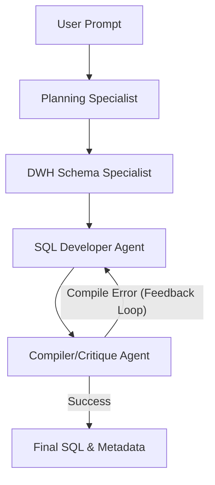
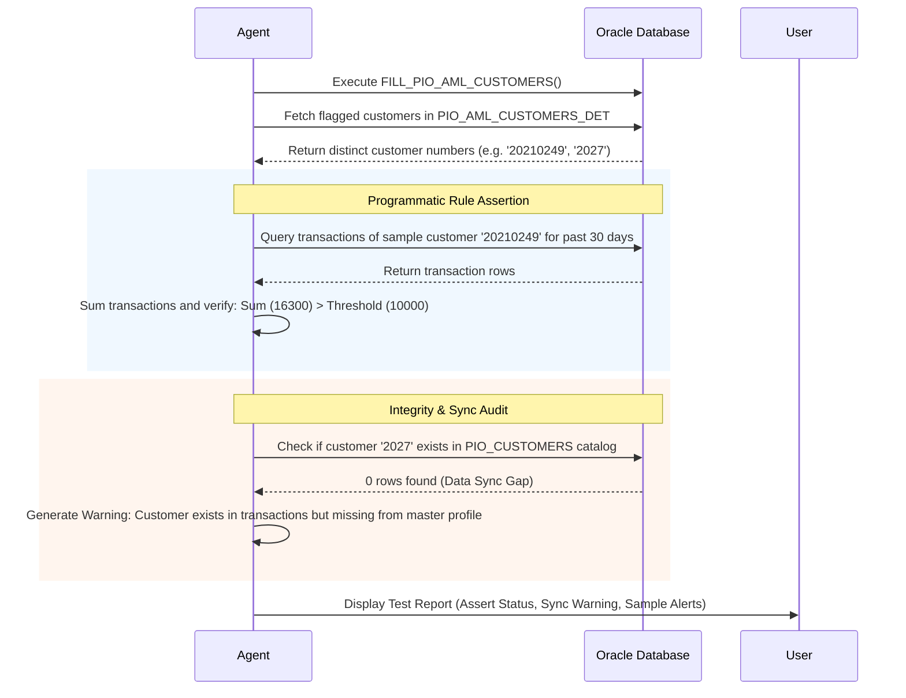
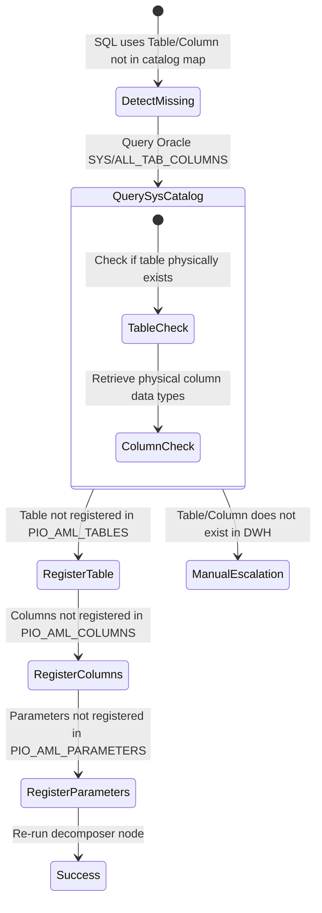

# Strategic Architectural Blueprint: Enterprise-Grade AML Agentic System

This document outlines the evolutionary roadmap to scale the compliance engine to a stable, highly consistent production system capable of automating **50%+ of banking AML scenario configurations**. 

The architecture is designed to bridge the gap between non-technical compliance officers (business users) and the physical database layout.

---

## 1. Multi-Agent Conversational SQL Engine (PioTech AI)

Rather than using a single LLM to generate queries, we transition to a collaborative multi-agent discussion schema:



### Key Refactoring Details:
1. **DWH Schema Specialist**: Understands table structures and physical data mapping. It translates business terms to DWH tables/views.
2. **SQL Developer Agent**: Takes the business mapping and writes high-performance, compliant Oracle SQL.
3. **Compiler / Critique Agent (Feedback Loop)**:
   - Does **not** just read the SQL text. It executes an `EXPLAIN PLAN FOR [SQL_QUERY]` directly against the Oracle DB database connection.
   - If Oracle returns an error (e.g. `ORA-00904: invalid identifier` or `ORA-00942: table or view does not exist`), it passes the **exact compiler error** back to the SQL Developer Agent with instructions to self-heal.
   - It only approves the SQL when the database compiles it successfully.

---

## 2. Advanced AI AML Agent Backend

The scenario configuration metadata builder is upgraded with business-level transparency, deep test assertions, and self-healing schema mapping.

### A. Business-Level Scenario Blueprint (Human-in-the-Loop)
Before any metadata is written to the database, the agent translates the technical requirements into a **plain-language Business Blueprint** for the user to review. This contains **zero technical codes** (no parameter codes, table names, or SQL syntax):

```markdown
# Scenario Blueprint: High Cash Activity Detection

## 1. Selected Filter
- We will monitor **Cash Outflow Transactions** (which includes Cash Withdrawals, ATM Withdrawals, and Teller Withdrawals).

## 2. Aggregations & Math
- We will calculate the **Sum of all Cash Outflows** for each customer.
- We will flag any customer whose total sum exceeds **10,000 JD**.

## 3. Time Window
- The evaluation will run daily, looking back at a rolling period of **30 days**.

## 4. Business Exclusions
- We will exclude **Corporate accounts**; only individual retail customers will be checked.
```

- **User Action**: The user reads this plain-language breakdown to confirm the business assumptions match their intent. They click **Approve & Build**.
- **Agent Action**: The agent parses this exact approved markdown blueprint to drive its database insert sequences, ensuring no drift between what the user approved and what is written.

---

### B. Advanced Testing, Validation, & Transparency Layer
Instead of simply checking if the stored procedure completed, the validator executes a thorough testing protocol:



1. **Programmatic Assertions**:
   - The validator picks a sample flagged customer from the details table (`PIO_AML_CUSTOMERS_DET`).
   - It queries their raw transactions from `PIO_TRANSACTIONS` for the target time window.
   - It programmatically verifies the rule math: e.g. calculates `SUM(TRA_AMT)` in Python and asserts that it matches the threshold in the plan (e.g. `16,300 JD > 10,000 JD`).
2. **Referential Integrity Audits**:
   - It checks for data synchronization gaps (e.g. customer exists in transaction tables but lacks a profile in `PIO_CUSTOMERS`).
   - Instead of treating this as a system failure, it classifies it as a **"DWH Sync Mismatch Warning"** so the user knows the rule configuration is correct, but their database environments are out of sync.
3. **Execution Transparency Logs**:
   - Displays a comprehensive test summary showing calculated metrics vs database actuals.

---

### C. Self-Healing Catalog Registration
If the SQL query utilizes a table or column that is missing from the compliance configuration catalog, the system will attempt to register it automatically rather than failing:



1. **Table Discovery**: The agent queries Oracle's system catalog (`ALL_TABLES` and `ALL_TAB_COLUMNS`) to confirm if the missing table/view physically exists in the database.
2. **Auto-Registration Script**:
   - If it exists, the agent generates and executes `INSERT` queries to register it in `PIO_AML_TABLES`.
   - It auto-populates `PIO_AML_COLUMNS` with the physical database column types (e.g. `VARCHAR2`, `NUMBER`) and default business descriptions.
   - It inserts a matching reference in `PIO_AML_PARAMETERS` so it can be evaluated by the compliance engine.
3. **Graceful Failures & Ticketing**:
   - If the table/column does not exist physically in the database, the agent stops the self-healing loop and generates a **DWH Ticket File** outlining the missing schema definitions for the DWH team to create.

---

## 3. Frontend Integration Evolution

The user interface will be updated to expose these advanced workflows:

1. **Plain-Text Plan Approver**: Displays the non-technical scenario blueprint with an interactive approval screen.
2. **Advanced Debug & Audit Console**:
   - Shows detail-level flagged transactions side-by-side with header alerts.
   - Highlights DWH synchronization warnings (e.g. missing customer profiles).
   - Shows catalog self-healing logs (e.g. *"Automatically registered table PIO_CARDS in Query Builder"*).
3. **Escalation Center**: Displays generated support tickets and configuration files if manual intervention is required.
