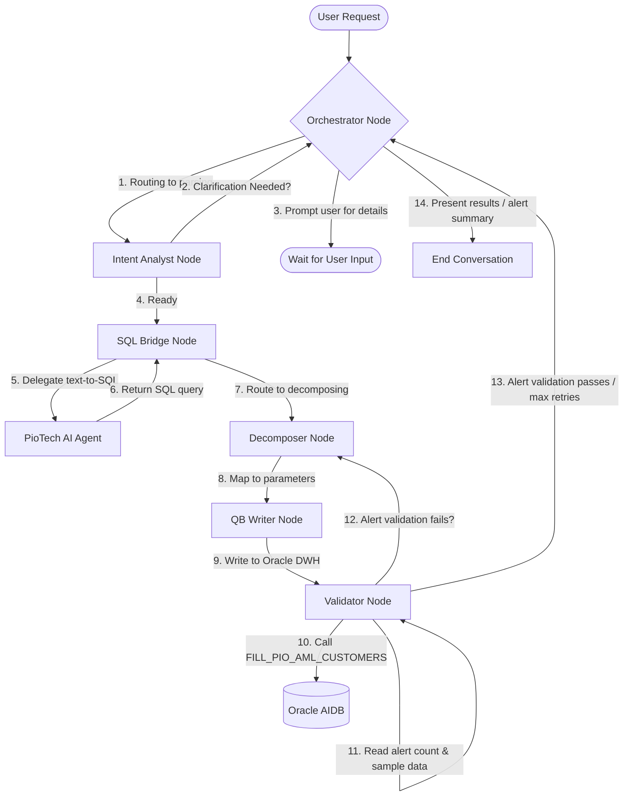

# AI AML Request Flow & Lifecycle

This document traces the complete end-to-end request flow of the autonomous multi-agent scenario builder. It details what happens at each stage of a request, from user input to final validation.

---

## 1. Request Flow Overview

The system is architected as a cyclic multi-agent graph built using **LangGraph**. The lifecycle moves through the following specialized nodes:

---

## 2. Step-by-Step Execution Lifecycle

### Step 2.1: Orchestrator Node (Lifecycle Guard)

* **What Happens:** The entry point for every user turn. The Orchestrator inspects the state's `next_action` parameter.
* **Logic:**
  * Checks hard execution limits (capped at `settings.MAX_AGENT_ITERATIONS`).
  * If validation succeeded, formats the final markdown report containing the scenario impact details.
  * If clarification is requested by the Intent Analyst, formats and serves the clarification questions.
  * Defaults routing to the **Intent Analyst**.

### Step 2.2: Intent Analyst Node (Business Extraction)

* **What Happens:** Converts the natural language request into a standardized, structured JSON entity (`AMLIntent` schema).
* **Logic:**
  * Uses the LLM to extract parameters: `scenario_name`, `scenario_type` (e.g. `TRANSACTION`, `ACCOUNT`, `CUSTOMER`, `DEBIT`, `COLLECTION`), `detection_logic`, `thresholds`, `time_window`, `customer_segments`, and `exclusions`.
  * If key business parameters are missing, sets `"clarification_needed": true` and lists user questions.
  * **Systematic Guard:** No technical questions are asked (e.g., table/column names). Only business choices are presented.

### Step 2.3: SQL Bridge Node (SQL Generation)

* **What Happens:** Acts as the bridge between the compliance orchestration system and the PioTech DWH AI database agent.
* **Logic:**
  * Translates the extracted `AMLIntent` structure into a metadata-rich prompt and calls the text-to-SQL streaming endpoint (`/chat/stream`).
  * Gathers the streamed SQL code chunks and parses the raw query.
  * **Metadata Extraction:** Extracts Referenced Tables, `WHERE` conditions, `GROUP BY` fields, `HAVING` aggregation criteria, and date/timestamp arithmetic from the SQL statement.

### Step 2.4: Decomposer Node (Parameter Mapping)

* **What Happens:** Maps the generated SQL and intent thresholds into Query Builder compliant parameters.
* **Logic:**
  * Queries `PIO_AML_PARAMETERS` dynamically at runtime to fetch the live database parameter codes catalog.
  * Maps SQL columns to the correct parameter codes:
    * **Transaction Type filters** (`EXPL_CODE` -> PARAMETER_CODE `'1'`, operator `'IN'`, formatted list e.g. `'''CHW'',''CAA'''`).
    * **Transaction Counts** (`COUNT` -> PARAMETER_CODE `'2'`).
    * **Transaction Sums** (`SUM` -> PARAMETER_CODE `'6'` and set `from_param_perc` to `100`).
    * **Single transaction amounts** (PARAMETER_CODE `'5'`).
  * Maps the rolling time window to the numeric `PIO_PERIOD_TYPE` lookup key (e.g. `'0'` for Last n Days, `'3'` for Monthly).
  * Assigns default system flags: active flag is set to `'1'`, violation level to `'1'`, risk degree to `'D'`, and rule type to `'3'` (representing standalone single rule blocks).

### Step 2.5: QB Writer Node (Oracle Transaction)

* **What Happens:** Safely writes the mapped configuration records into the four relational Query Builder engine tables.
* **Logic:**
  * Inserts the scenario header record to `PIO_AML_SCENARIO`.
  * Inserts the rule metadata record to `PIO_AML_RULES`.
  * Links scenario and rule in `PIO_AML_SCENARIO_RULES`.
  * Batch-inserts condition details to `PIO_AML_RULES_DETAILS`.

### Step 2.6: Validator Node (Self-Correction & Testing)

* **What Happens:** Runs a dynamic sanity check loop to test if the created scenario generates valid alerts.
* **Logic:**
  * Calls the stored procedure `FILL_PIO_AML_CUSTOMERS` directly in the database.
  * Queries `PIO_AML_CUSTOMERS` to check if the new scenario generated alerts.
  * **Evaluation criteria:**
    * If alert count matches the intent's expected boundaries (or is greater than 0 by default) and procedure status code is `0`, validation succeeds.
    * If `0` alerts are returned, validation fails.
  * **Self-Healing Loop:** If validation fails, it records the diagnosis, increments the validation retry count, and routes the state back to the **Decomposer** node to adjust thresholds (up to `settings.MAX_VALIDATION_RETRIES`).
  * If validation succeeds (or max retries are reached), routes to the **Orchestrator** to present the final report.

---

## 3. Configuration & State Variables

The request state and parameters are governed by Pydantic models in `web/services/schemas.py`. Environmental defaults are configurable in `.env`.

### Key System Constants

- `AML_COUNTRY_CODE`: Country ID (e.g. `400`).
- `AML_INST_CODE`: Institution ID (e.g. `1`).
- `MAX_VALIDATION_RETRIES`: Hard limit of validation self-corrections (default `3`).
- `CHECKPOINT_DB_PATH`: Target path for SQLite checkpoint persistence.
